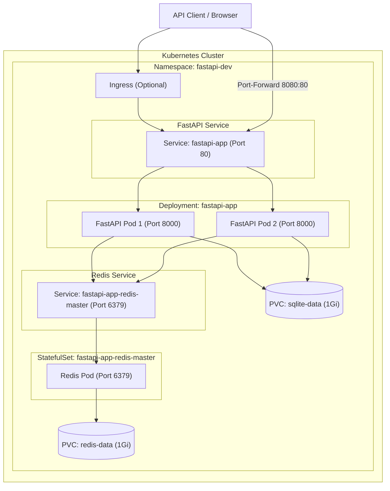

# Kubernetes Deployment Guide — Helm & Helmfile

Complete step-by-step guide to deploy **fastapi-sqlite-redis** on Kubernetes using Helm and Helmfile.

---

## Table of Contents

1. [Architecture Overview](#architecture-overview)
2. [Prerequisites](#prerequisites)
3. [Project Structure](#project-structure)
4. [Kubernetes Concepts Covered](#kubernetes-concepts-covered)
5. [Option A — Deploy with Helm (Direct)](#option-a--deploy-with-helm-direct)
6. [Option B — Deploy with Helmfile (Recommended)](#option-b--deploy-with-helmfile-recommended)
7. [Post-Deployment Verification](#post-deployment-verification)
8. [Day-2 Operations](#day-2-operations)
9. [Troubleshooting](#troubleshooting)
10. [Cleanup](#cleanup)

---

## Architecture Overview



**Key Components:**
- **Deployment** → Manages FastAPI pods with rolling updates
- **StatefulSet** → Manages Redis with stable network identity & persistent storage
- **Service (ClusterIP)** → Internal load balancing for both FastAPI and Redis
- **PersistentVolumeClaim** → Durable storage for SQLite data and Redis data
- **ConfigMap** → Non-sensitive config (Redis host/port)
- **ServiceAccount** → Pod identity
- **Ingress** → External HTTP routing (optional)
- **HPA** → Autoscaling (optional, enabled in production)

---

## Prerequisites

### 1. Install Required Tools

```bash
# Kubernetes CLI
brew install kubectl

# Helm (v3+)
brew install helm

# Helmfile
brew install helmfile

# Optional: Install helmfile diff plugin (shows what will change before applying)
helm plugin install https://github.com/databus23/helm-diff
```

### 2. Kubernetes Cluster

You need a running cluster. For local development, use any of:

```bash
# Option 1: Docker Desktop (enable Kubernetes in Settings → Kubernetes)

# Option 2: minikube
brew install minikube
minikube start --driver=docker --cpus=2 --memory=4096

# Option 3: kind (Kubernetes IN Docker)
brew install kind
kind create cluster --name fastapi-lab
```

### 3. Verify Your Setup

```bash
# Check kubectl is connected to a cluster
kubectl cluster-info

# Check Helm version (should be v3+)
helm version --short

# Check Helmfile version
helmfile version
```

---

## Project Structure

```
fastapi-sqlite-redis/
├── helm/
│   └── fastapi-app/                  # Helm chart
│       ├── Chart.yaml                # Chart metadata
│       ├── values.yaml               # Default values
│       ├── .helmignore               # Files to ignore in packaging
│       └── templates/
│           ├── _helpers.tpl          # Template helper functions
│           ├── configmap.yaml        # ConfigMap (env vars)
│           ├── deployment.yaml       # FastAPI Deployment
│           ├── service.yaml          # FastAPI Service
│           ├── serviceaccount.yaml   # ServiceAccount
│           ├── pvc.yaml              # PVC for SQLite data
│           ├── ingress.yaml          # Ingress (optional)
│           ├── hpa.yaml              # HorizontalPodAutoscaler (optional)
│           ├── redis-statefulset.yaml# Redis StatefulSet
│           ├── redis-service.yaml    # Redis Service
│           ├── NOTES.txt             # Post-install instructions
│           └── tests/
│               └── test-connection.yaml  # Helm test
├── environments/
│   ├── dev/values.yaml               # Dev overrides
│   ├── staging/values.yaml           # Staging overrides
│   └── prod/values.yaml              # Production overrides
├── helmfile.yaml                     # Helmfile declarative config
└── DEPLOYMENT.md                     # ← You are here
```

---

## Kubernetes Concepts Covered

| K8s Resource | File | Purpose |
|---|---|---|
| **Deployment** | `deployment.yaml` | Manages FastAPI pod replicas, rolling updates, rollback |
| **ReplicaSet** | _(managed by Deployment)_ | Ensures desired number of pods are running |
| **StatefulSet** | `redis-statefulset.yaml` | Redis with stable identity & ordered pod management |
| **Service (ClusterIP)** | `service.yaml`, `redis-service.yaml` | Internal load balancing & service discovery |
| **ConfigMap** | `configmap.yaml` | Externalized, non-sensitive configuration |
| **ServiceAccount** | `serviceaccount.yaml` | Pod identity & RBAC bindings |
| **PersistentVolumeClaim** | `pvc.yaml`, `redis-statefulset.yaml` | Persistent storage that survives pod restarts |
| **Ingress** | `ingress.yaml` | Layer-7 HTTP routing with host/path rules |
| **HPA** | `hpa.yaml` | Auto-scales pods based on CPU/memory utilization |
| **Liveness Probe** | `deployment.yaml` | Restarts pod if app becomes unresponsive |
| **Readiness Probe** | `deployment.yaml` | Removes pod from service endpoints when not ready |
| **Startup Probe** | `deployment.yaml` | Protects slow-starting pods from premature kills |
| **Rolling Update** | `deployment.yaml` | Zero-downtime deploys (maxSurge/maxUnavailable) |
| **Security Context** | `deployment.yaml` | Runs as non-root, no privilege escalation |
| **Resource Limits** | `deployment.yaml` | CPU/memory requests and limits for QoS |

---

## Option A — Deploy with Helm (Direct)

Use this approach for quick, single-environment deployments.

### Step 1: Validate the Chart

```bash
# Lint the chart for errors
helm lint ./helm/fastapi-app

# Render templates locally to inspect generated YAML (dry-run)
helm template fastapi-app ./helm/fastapi-app --namespace fastapi-dev
```

### Step 2: Install the Chart

```bash
# Create namespace and install
helm install fastapi-app ./helm/fastapi-app \
  --namespace fastapi-dev \
  --create-namespace \
  --wait \
  --timeout 5m
```

### Step 3: Override Values for Different Environments

```bash
# Install with dev overrides
helm install fastapi-app ./helm/fastapi-app \
  --namespace fastapi-dev \
  --create-namespace \
  -f ./environments/dev/values.yaml \
  --wait

# Install with production overrides
helm install fastapi-app ./helm/fastapi-app \
  --namespace fastapi-prod \
  --create-namespace \
  -f ./environments/prod/values.yaml \
  --wait
```

### Step 4: Upgrade an Existing Release

```bash
# Upgrade with new values or image tag
helm upgrade fastapi-app ./helm/fastapi-app \
  --namespace fastapi-dev \
  --set image.tag="2.0.0" \
  --wait
```

### Step 5: Run Helm Tests

```bash
helm test fastapi-app --namespace fastapi-dev
```

---

## Option B — Deploy with Helmfile (Recommended)

Helmfile wraps Helm and adds multi-environment, declarative deployment management.

### Step 1: Preview the Changes (Diff)

```bash
# See what will be deployed (requires helm-diff plugin)
helmfile -e dev diff
```

### Step 2: Deploy to Dev

```bash
helmfile -e dev sync
```

### Step 3: Deploy to Staging

```bash
helmfile -e staging sync
```

### Step 4: Deploy to Production

```bash
helmfile -e prod sync
```

### Step 5: Check Status

```bash
helmfile -e dev status
```

### Step 6: Destroy / Tear Down

```bash
helmfile -e dev destroy
```

---

## Post-Deployment Verification

### Check All Resources

```bash
# Set the namespace for convenience
export NS=fastapi-dev

# View all resources
kubectl get all -n $NS

# View pods with additional detail
kubectl get pods -n $NS -o wide

# View services
kubectl get svc -n $NS

# View PVCs
kubectl get pvc -n $NS

# View ConfigMaps
kubectl get configmap -n $NS

# View the deployment in detail
kubectl describe deployment fastapi-app -n $NS

# View the StatefulSet
kubectl describe statefulset fastapi-app-redis-master -n $NS
```

### Access the Application

Depending on how your Kubernetes cluster is running (especially in local environments), accessing the application via `NodePort` or `localhost` varies:

#### Option A: Port Forwarding (Recommended & Cluster-Agnostic)
Port forwarding tunnels traffic directly from your machine to the Kubernetes service. It works in all clusters (Kind, Minikube, cloud providers, etc.).

```bash
# Tunnel port 8080 on your host machine to port 80 of the service
kubectl port-forward svc/fastapi-app 8080:80 -n $NS
```

> [!NOTE]
> If you get a `bind: address already in use` error, it means another process (or port-forward) is running on `8080`. Simply map it to a different local port (like `8081` or `9000`):
> ```bash
> kubectl port-forward svc/fastapi-app 8081:80 -n $NS
> ```

Once the tunnel is active, access the app at `http://localhost:8080` (or `http://localhost:8081`).

#### Option B: Accessing NodePort directly (Setup-Dependent)
The Helm chart exposes the web service using `NodePort` on port `31724` by default:

- **Docker Desktop**: The service is automatically mapped to localhost. Access it at `http://localhost:31724`.
- **Minikube**: NodePort requires retrieving the Minikube virtual machine IP. Run:
  ```bash
  minikube service fastapi-app -n $NS --url
  ```
- **Kind on macOS / Windows**: Because Kind runs inside Docker containers (which run in a virtual machine on macOS/Windows), node IPs are **not** directly routable from your host. You **must** either use Port Forwarding (Option A above) or have pre-configured `extraPortMappings` on ports `80`/`443` when you created the Kind cluster.

#### Test the Endpoints
With either method, you can verify connection using `curl`:
```bash
# Fetch root & health check
curl http://localhost:8080/
curl http://localhost:8080/health

# Database and counter integrations
curl http://localhost:8080/items
curl -X POST http://localhost:8080/items -H "Content-Type: application/json" -d '{"name": "hello-k8s"}'
curl http://localhost:8080/items/cached
curl http://localhost:8080/counter
curl http://localhost:8080/network-info
```

### Check Pod Logs

```bash
# View logs from a specific pod
kubectl logs -l app.kubernetes.io/name=fastapi-app -n $NS --tail=50

# Stream logs in real-time
kubectl logs -l app.kubernetes.io/name=fastapi-app -n $NS -f

# View Redis logs
kubectl logs -l app.kubernetes.io/component=redis -n $NS --tail=50
```

### Verify Probes Are Working

```bash
# Describe a pod to see probe status and events
kubectl describe pod -l app.kubernetes.io/name=fastapi-app -n $NS | grep -A 5 "Liveness\|Readiness\|Startup"
```

---

## Day-2 Operations

### Scale the Deployment

```bash
# Manual scale
kubectl scale deployment fastapi-app -n $NS --replicas=5

# Or via Helm upgrade
helm upgrade fastapi-app ./helm/fastapi-app \
  --namespace $NS \
  --set replicaCount=5 \
  --wait
```

### Rolling Update (New Image Version)

```bash
# Update image tag via Helm
helm upgrade fastapi-app ./helm/fastapi-app \
  --namespace $NS \
  --set image.tag="2.0.0" \
  --wait

# Watch the rolling update progress
kubectl rollout status deployment/fastapi-app -n $NS
```

### Rollback a Release

```bash
# View release history
helm history fastapi-app -n $NS

# Rollback to previous revision
helm rollback fastapi-app 1 -n $NS

# Or rollback to a specific revision
helm rollback fastapi-app <REVISION_NUMBER> -n $NS
```

### Enable Autoscaling

```bash
helm upgrade fastapi-app ./helm/fastapi-app \
  --namespace $NS \
  --set autoscaling.enabled=true \
  --set autoscaling.minReplicas=2 \
  --set autoscaling.maxReplicas=10 \
  --wait

# Check HPA status
kubectl get hpa -n $NS
```

### Enable Ingress

```bash
# Make sure you have an Ingress Controller installed first
# (e.g., NGINX Ingress Controller)
kubectl apply -f https://raw.githubusercontent.com/kubernetes/ingress-nginx/controller-v1.10.0/deploy/static/provider/cloud/deploy.yaml

# Deploy with Ingress enabled
helm upgrade fastapi-app ./helm/fastapi-app \
  --namespace $NS \
  --set ingress.enabled=true \
  --set ingress.hosts[0].host=fastapi.local \
  --set ingress.hosts[0].paths[0].path=/ \
  --set ingress.hosts[0].paths[0].pathType=Prefix \
  --wait

# For local testing, add to /etc/hosts
echo "127.0.0.1 fastapi.local" | sudo tee -a /etc/hosts
```

### Exec Into a Pod

```bash
# Open a shell in the FastAPI pod
kubectl exec -it deploy/fastapi-app -n $NS -- /bin/bash

# Connect to Redis CLI
kubectl exec -it fastapi-app-redis-master-0 -n $NS -- redis-cli
```

### View Resource Usage (requires metrics-server)

```bash
# Pod resource usage
kubectl top pods -n $NS

# Node resource usage
kubectl top nodes
```

---

## Troubleshooting

### Pod is CrashLoopBackOff

```bash
# Check pod events
kubectl describe pod <POD_NAME> -n $NS

# Check previous container logs
kubectl logs <POD_NAME> -n $NS --previous
```

### Pod is Pending (no node to schedule)

```bash
# Check events
kubectl get events -n $NS --sort-by='.lastTimestamp'

# Check node resources
kubectl describe nodes | grep -A 5 "Allocated resources"
```

### PVC is Pending

```bash
# Check if StorageClass exists
kubectl get storageclass

# For minikube, the default SC is 'standard'
# For Docker Desktop, the default SC is 'hostpath'
# For kind, you may need to install a provisioner
```

### Redis Connection Refused

```bash
# Verify Redis service is running
kubectl get svc -n $NS | grep redis

# Test connectivity from a FastAPI pod
kubectl exec -it deploy/fastapi-app -n $NS -- \
  python -c "import redis; r = redis.Redis(host='fastapi-app-redis-master', port=6379); print(r.ping())"
```

### ImagePullBackOff

```bash
# Verify the image exists on Docker Hub
docker pull sany2k8/fastapi-sqlite-redis-app:latest

# Check pod events for the exact error
kubectl describe pod <POD_NAME> -n $NS | grep -A 5 "Events"
```

---

## Cleanup

### Remove a Single Release

```bash
# With Helm
helm uninstall fastapi-app -n fastapi-dev

# With Helmfile
helmfile -e dev destroy
```

### Remove Everything (including namespace and PVCs)

```bash
# Delete namespace (removes ALL resources inside it)
kubectl delete namespace fastapi-dev

# If using Helmfile for multiple environments
helmfile -e dev destroy
helmfile -e staging destroy
helmfile -e prod destroy

kubectl delete namespace fastapi-dev fastapi-staging fastapi-prod
```

### Delete the Cluster (local only)

```bash
# minikube
minikube delete

# kind
kind delete cluster --name fastapi-lab
```

---

## Quick Reference — Common Commands

| Action | Command |
|---|---|
| Lint chart | `helm lint ./helm/fastapi-app` |
| Dry-run | `helm template fastapi-app ./helm/fastapi-app` |
| Install (dev) | `helmfile -e dev sync` |
| Upgrade | `helm upgrade fastapi-app ./helm/fastapi-app -n fastapi-dev --wait` |
| Rollback | `helm rollback fastapi-app 1 -n fastapi-dev` |
| Status | `helm status fastapi-app -n fastapi-dev` |
| History | `helm history fastapi-app -n fastapi-dev` |
| Test | `helm test fastapi-app -n fastapi-dev` |
| Port-forward | `kubectl port-forward svc/fastapi-app 8080:80 -n fastapi-dev` |
| Logs | `kubectl logs -l app.kubernetes.io/name=fastapi-app -n fastapi-dev -f` |
| Scale | `kubectl scale deploy/fastapi-app -n fastapi-dev --replicas=5` |
| Destroy | `helmfile -e dev destroy` |
