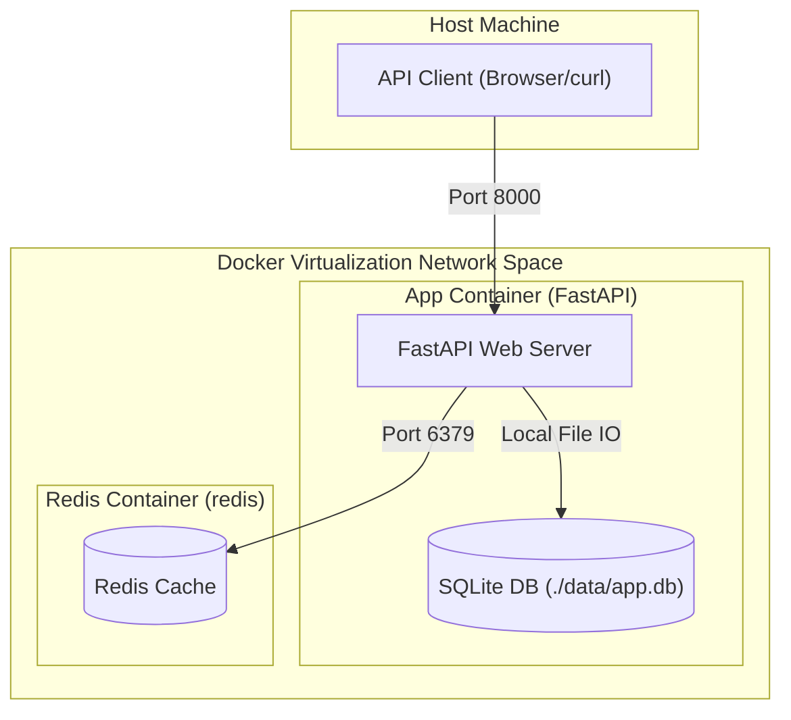

# FastAPI + SQLite + Redis Networking Lab

[](https://fastapi.tiangolo.com/)
[](https://www.docker.com/)
[](https://redis.io/)
[](https://www.python.org/)

This project is a sandbox lab designed to explore and demonstrate different **Docker networking modes** (Bridge, Host, and None) using a FastAPI backend, a persistent SQLite database, and a Redis cache. 

It provides endpoints to check container networking info (`/network-info`), inspect database and cache integration (cache-aside pattern on `/items/cached`), and run real-time caching operations.

---

## Architecture Diagram

The system operates differently depending on the network configuration:



---

## Features & Endpoints

| Endpoint | Method | Description |
| :--- | :--- | :--- |
| `/` | `GET` | Welcome message and listing of all available endpoints. |
| `/health` | `GET` | Simple health check endpoint returning `{"status": "ok"}`. |
| `/network-info` | `GET` | Displays current container hostname, container IP, and Redis connectivity metrics. |
| `/items` | `GET` | Fetches a list of items stored in the SQLite database. |
| `/items` | `POST` | Adds a new item to the SQLite database and invalidates the cached items list. |
| `/items/cached` | `GET` | Implements the **cache-aside** pattern. Looks in Redis first; if absent, fetches from SQLite and stores in Redis for 30s. |
| `/counter` | `GET` | Demonstrates real-time Redis integration by incrementing and returning a hit counter. |

---

## Getting Started

### Prerequisites

- **Docker** and **Docker Compose** installed.
- Python 3.12+ (optional, only if you wish to run the app outside of Docker).

### 1. Default Setup: Bridge Network Mode

By default, Docker Compose spins up the FastAPI app and Redis in a custom bridge network where the containers communicate using Docker's internal DNS.

```bash
# Start the containers
docker compose up --build -d

# Verify that the containers are running
docker compose ps
```

Access the API documentation at: **`http://localhost:8000/docs`**

To clean up:
```bash
docker compose down -v
```

---

## Docker Networking Experiments

The application is built to demonstrate three distinct Docker networking modes. Below is how to test and verify each of them using the main `docker-compose.yml` or manual overrides.

### Experiment 1: Bridge Network (Default)

In this mode, Docker creates a private internal bridge network. The application container accesses Redis via the service name alias `redis` configured in `docker-compose.yml`.

- **Environment settings**: `REDIS_HOST=redis`

#### Testing Bridge Mode
1. Run:
   ```bash
   docker compose up --build -d
   ```
2. Open `http://localhost:8000/network-info`
3. **Expected JSON response**:
   ```json
   {
     "container_hostname": "<container-id>",
     "container_ip": "172.x.x.x",
     "redis": {
       "redis_host_configured": "redis",
       "redis_port_configured": 6379,
       "container_hostname": "<container-id>",
       "reachable": true
     }
   }
   ```
4. Clean up:
   ```bash
   docker compose down -v
   ```

---

### Experiment 2: Host Network

In host network mode, the container shares the host machine's network namespace directly. It does not get its own private IP address, and ports are bound directly to the host.

To run the experiment in Host network mode:
1. Open [docker-compose.yml](file:///Users/sany/Projects/fastapi-sqlite-redis/docker-compose.yml).
2. Set `network_mode: host` on both services and remove/comment out the `ports` mapping (since ports map automatically to the host namespace in host mode).
3. Set the environment variable `REDIS_HOST=127.0.0.1`.
4. Run:
   ```bash
   docker compose up --build -d
   ```

> [!WARNING]
> **Docker Desktop for Mac & Windows Limitation**
>
> On macOS and Windows, Docker runs inside a lightweight Linux utility Virtual Machine (VM). Therefore:
> 1. `network_mode: host` binds the container ports directly to the **Docker VM**, not your Mac/Windows host machine.
> 2. You **cannot** access `http://localhost:8000` from your Mac browser directly in this mode.
> 3. To connect to the app in Host mode, you would need to hit the internal IP address of the Docker utility VM or run the experiment on a native Linux host.
> 4. For testing on Linux, the containers will be reachable at `http://localhost:8000`.

If testing on native Linux, `http://localhost:8000/network-info` will show:
```json
{
  "container_hostname": "<your-host-machine-name>",
  "container_ip": "<your-host-ip>",
  "redis": {
    "redis_host_configured": "127.0.0.1",
    "redis_port_configured": 6379,
    "container_hostname": "<your-host-machine-name>",
    "reachable": true
  }
}
```

---

### Experiment 3: None Network

In this mode, the container is placed in a completely isolated network stack with only the loopback interface (`lo` / `127.0.0.1`). It has no route to the outside world and cannot connect to Redis.

To run the experiment in None network mode:
1. Open [docker-compose.yml](file:///Users/sany/Projects/fastapi-sqlite-redis/docker-compose.yml).
2. Set `network_mode: none` on the `app` service and comment out the `ports` mapping.
3. Run:
   ```bash
   docker compose up --build -d
   ```

In this mode:
- SQLite operations on `/items` will **still work** because SQLite is file-based and runs locally.
- Redis-dependent endpoints like `/counter` will fail gracefully, returning `"source": "redis-unreachable"`.

---

## Building and Pushing to Docker Hub

You can build and publish this application image to Docker Hub using the steps below.

### 1. Build and Tag the Image Locally
Build the image locally and tag it with your Docker Hub username:
```bash
# Replace <username> with your actual Docker Hub username
docker build -t <username>/fastapi-sqlite-redis-lab:latest .
```

### 2. Authenticate with Docker Hub
Log in to your Docker Hub account from the CLI:
```bash
docker login
```
Provide your Docker Hub username and password or Personal Access Token (PAT) when prompted.

### 3. Push the Image to Docker Hub
Push the tagged image to your Docker Hub registry:
```bash
docker push <username>/fastapi-sqlite-redis-lab:latest
```

### Pro-Tip: Multi-Platform Builds (Optional)
If you want to build and push images supporting both Apple Silicon (ARM64) and Linux/Intel (AMD64) environments:
```bash
# Create and start a buildx builder
docker buildx create --use

# Build, tag, and push in a single step
docker buildx build --platform linux/amd64,linux/arm64 \
  -t <username>/fastapi-sqlite-redis-lab:latest \
  --push .
```

---

## Local Development (Without Docker)

To run the application locally on your host machine:

1. Make sure you have [uv](https://github.com/astral-sh/uv) installed.
2. Install dependencies:
   ```bash
   uv sync
   ```
3. Run a local Redis instance on port 6379 (if you want caching features to work).
4. Run the FastAPI application:
   ```bash
   uv run uvicorn app.main:app --reload --host 127.0.0.1 --port 8000
   ```

