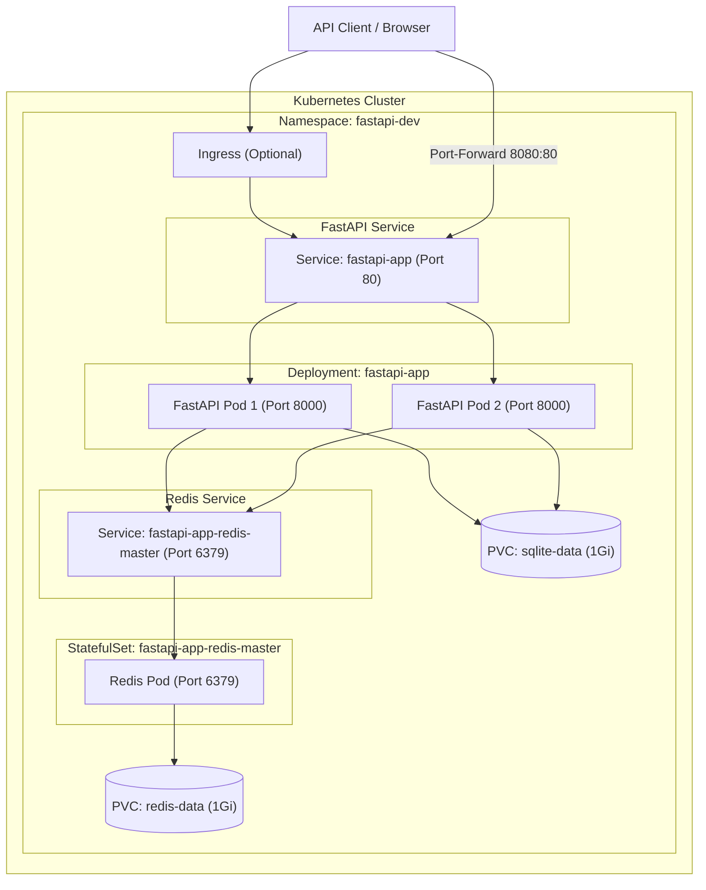

# Kubernetes Deployment Lab — FastAPI + SQLite + Redis

[](https://fastapi.tiangolo.com/)
[](https://kubernetes.io/)
[](https://helm.sh/)
[](https://redis.io/)

This project is a hands-on sandbox lab designed to demonstrate how to package and orchestrate an existing multi-tier web application into Kubernetes. It leverages **Helm** and **Helmfile** for declarative, environment-specific deployments.

The architecture features a FastAPI backend, a persistent SQLite database storing state inside a PersistentVolumeClaim (PVC), and a Redis cache structured as a StatefulSet.

---

## Architecture Diagram

The Kubernetes infrastructure layout for the deployment:



---

## Features & Endpoints

| Endpoint | Method | Description |
| :--- | :--- | :--- |
| `/` | `GET` | Welcome message and listing of all available endpoints. |
| `/health` | `GET` | Simple health check endpoint returning `{"status": "ok"}`. |
| `/network-info` | `GET` | Displays current container hostname, container IP, and Redis connectivity metrics. |
| `/items` | `GET` | Fetches a list of items stored in the SQLite database. |
| `/items` | `POST` | Adds a new item to the SQLite database and invalidates the cached items list. |
| `/items/cached` | `GET` | Implements the **cache-aside** pattern. Looks in Redis first; if absent, fetches from SQLite and stores in Redis for 30s. |
| `/counter` | `GET` | Demonstrates real-time Redis integration by incrementing and returning a hit counter. |

---

## Getting Started

### Prerequisites

- **Docker** and **Docker Compose** installed.
- Python 3.12+ (optional, only if you wish to run the app outside of Docker).

## Kubernetes Deployment (Helm & Helmfile)

This project contains a fully configured Helm chart and a declarative Helmfile configuration to orchestrate the FastAPI application, its SQLite database (utilizing Persistent Volume Claims), and a Redis StatefulSet cache in Kubernetes.

For complete, detailed instructions on how to install prerequisites, deploy the application using Helm or Helmfile, verify your setup, perform rolling updates, and rollback releases, please refer to the dedicated **[Kubernetes Deployment Guide (DEPLOYMENT.md)](./DEPLOYMENT.md)**.

### Quick Reference Commands

For full details and environments (e.g. `staging` or `prod`), see [DEPLOYMENT.md](./DEPLOYMENT.md).

```bash
# Preview changes before applying via Helmfile
helmfile -e dev diff

# Sync/Deploy changes via Helmfile
helmfile -e dev sync

# View all resources in the dev namespace
kubectl get all -n fastapi-dev
```

---

## Building and Pushing to Docker Hub

You can build and publish this application image to Docker Hub using the steps below.

### 1. Build and Tag the Image Locally
Build the image locally and tag it with your Docker Hub username:
```bash
# Replace <username> with your actual Docker Hub username
docker build -t <username>/fastapi-sqlite-redis-app:latest .
```

### 2. Authenticate with Docker Hub
Log in to your Docker Hub account from the CLI:
```bash
docker login
```
Provide your Docker Hub username and password or Personal Access Token (PAT) when prompted.

### 3. Push the Image to Docker Hub
Push the tagged image to your Docker Hub registry:
```bash
docker push <username>/fastapi-sqlite-redis-app:latest
```

### Pro-Tip: Multi-Platform Builds (Optional)
If you want to build and push images supporting both Apple Silicon (ARM64) and Linux/Intel (AMD64) environments:
```bash
# Create and start a buildx builder
docker buildx create --use

# Build, tag, and push in a single step
docker buildx build --platform linux/amd64,linux/arm64 \
  -t <username>/fastapi-sqlite-redis-app:latest \
  --push .
```

---

## Local Development (Without Docker)

To run the application locally on your host machine:

1. Make sure you have [uv](https://github.com/astral-sh/uv) installed.
2. Install dependencies:
   ```bash
   uv sync
   ```
3. Run a local Redis instance on port 6379 (if you want caching features to work).
4. Run the FastAPI application:
   ```bash
   uv run uvicorn app.main:app --reload --host 127.0.0.1 --port 8000
   ```
