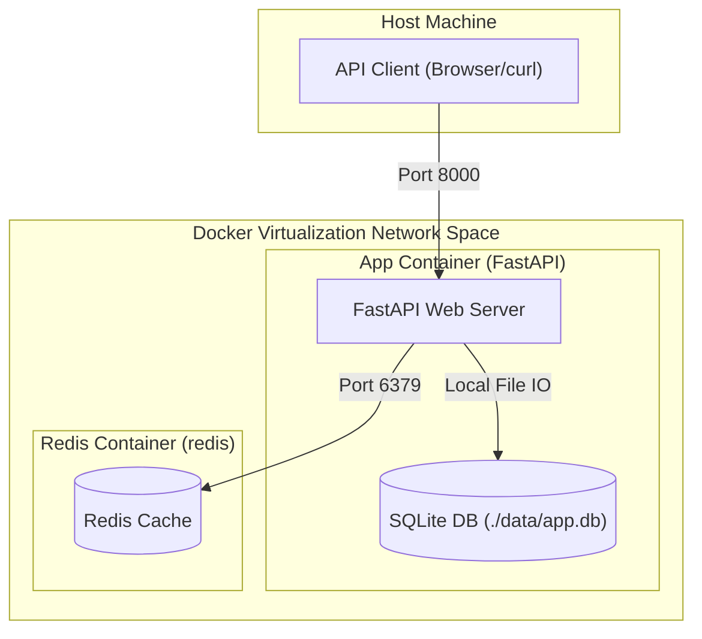

# FastAPI + SQLite + Redis Networking Lab

[](https://fastapi.tiangolo.com/)
[](https://www.docker.com/)
[](https://redis.io/)
[](https://www.python.org/)

This project is a sandbox lab designed to explore and demonstrate different **Docker networking modes** (Bridge, Host, and None) using a FastAPI backend, a persistent SQLite database, and a Redis cache.

It provides endpoints to check container networking info (`/network-info`), inspect database and cache integration (cache-aside pattern on `/items/cached`), and run real-time caching operations.

---

## Architecture Diagram

The system operates differently depending on the network configuration:



---

## Features & Endpoints

| Endpoint | Method | Description |
| :--- | :--- | :--- |
| `/` | `GET` | Welcome message and listing of all available endpoints. |
| `/health` | `GET` | Simple health check endpoint returning `{"status": "ok"}`. |
| `/network-info` | `GET` | Displays current container hostname, container IP, and Redis connectivity metrics. |
| `/items` | `GET` | Fetches a list of items stored in the SQLite database. |
| `/items` | `POST` | Adds a new item to the SQLite database and invalidates the cached items list. |
| `/items/cached` | `GET` | Implements the **cache-aside** pattern. Looks in Redis first; if absent, fetches from SQLite and stores in Redis for 30s. |
| `/counter` | `GET` | Demonstrates real-time Redis integration by incrementing and returning a hit counter. |

---

## Getting Started

### Prerequisites

- **Docker** and **Docker Compose** installed.
- Python 3.12+ (optional, only if you wish to run the app outside of Docker).

## Kubernetes Deployment (Helm & Helmfile)

This project contains a fully configured Helm chart and a declarative Helmfile setup to run the FastAPI application, SQLite database (with persistent volumes), and a Redis StatefulSet in a Kubernetes cluster.

### Prerequisites

- **kubectl** CLI installed.
- **Helm** (v3+) installed.
- **Helmfile** installed.
- A running Kubernetes cluster (e.g., Minikube, Kind, Docker Desktop Kubernetes).

---

### Installing Helm and Helmfile

#### Install Helm

Helm is the Kubernetes package manager. Follow these instructions based on your operating system:

**macOS (using Homebrew):**
```bash
brew install helm
```

**Linux (using curl):**
```bash
curl https://raw.githubusercontent.com/helm/helm/main/scripts/get-helm-3 | bash
```

**Windows (using Chocolatey):**
```bash
choco install kubernetes-helm
```

**Verify the installation:**
```bash
helm version
```

For detailed installation instructions, visit the [official Helm documentation](https://helm.sh/docs/intro/install/).

---

#### Install Helmfile

Helmfile is a declarative way to manage Helm charts across multiple environments. Install it using:

**macOS (using Homebrew):**
```bash
brew install helmfile
```

**Linux (using curl):**
```bash
wget https://github.com/roboll/helmfile/releases/download/v0.144.0/helmfile_linux_amd64
chmod +x helmfile_linux_amd64
sudo mv helmfile_linux_amd64 /usr/local/bin/helmfile
```

**Windows (using Chocolatey):**
```bash
choco install helmfile
```

**Verify the installation:**
```bash
helmfile version
```

For detailed installation instructions, visit the [official Helmfile documentation](https://github.com/roboll/helmfile).

---

### Option A: Deploying with Helm (Directly)

Use Helm to install the chart in a single namespace (e.g., `fastapi-dev`):

```bash
# 1. Validate the Helm chart structure
helm lint ./helm/fastapi-app

# 2. Deploy/Install the application and Redis dependency
helm install fastapi-app ./helm/fastapi-app \
  --namespace fastapi-dev \
  --create-namespace \
  --wait \
  --timeout 5m
```

To override values for specific environments (e.g., using staging configurations):
```bash
helm install fastapi-app ./helm/fastapi-app \
  --namespace fastapi-staging \
  --create-namespace \
  -f ./environments/staging/values.yaml \
  --wait
```

---

### Option B: Deploying with Helmfile (Declarative & Recommended)

Helmfile allows you to manage deployments declaratively across environments (`dev`, `staging`, `prod`) using environment-specific values files.

```bash
# 1. Preview changes before applying (dry-run)
helmfile -e dev diff

# 2. Deploy to the dev environment
helmfile -e dev sync
```

To deploy to other environments:
```bash
# Deploy to staging
helmfile -e staging sync

# Deploy to production
helmfile -e prod sync
```

---

### Post-Deployment & Verification

1. **Verify Resources are Running**:
   ```bash
   kubectl get all -n fastapi-dev
   ```

2. **Access the Application**:
   Port-forward the FastAPI service to your local machine:
   ```bash
   kubectl port-forward svc/fastapi-app 8080:80 -n fastapi-dev
   ```
   Now open your browser to **`http://localhost:8080/docs`** to view endpoints.

3. **Verify Caching and DB functionality**:
   ```bash
   # Test counter (Redis integration)
   curl http://localhost:8080/counter

   # Test cache-aside items retrieval
   curl http://localhost:8080/items/cached
   ```

4. **Run Helm Tests**:
   ```bash
   helm test fastapi-app -n fastapi-dev
   ```


---

## Building and Pushing to Docker Hub

You can build and publish this application image to Docker Hub using the steps below.

### 1. Build and Tag the Image Locally
Build the image locally and tag it with your Docker Hub username:
```bash
# Replace <username> with your actual Docker Hub username
docker build -t <username>/fastapi-sqlite-redis-lab:latest .
```

### 2. Authenticate with Docker Hub
Log in to your Docker Hub account from the CLI:
```bash
docker login
```
Provide your Docker Hub username and password or Personal Access Token (PAT) when prompted.

### 3. Push the Image to Docker Hub
Push the tagged image to your Docker Hub registry:
```bash
docker push <username>/fastapi-sqlite-redis-lab:latest
```

### Pro-Tip: Multi-Platform Builds (Optional)
If you want to build and push images supporting both Apple Silicon (ARM64) and Linux/Intel (AMD64) environments:
```bash
# Create and start a buildx builder
docker buildx create --use

# Build, tag, and push in a single step
docker buildx build --platform linux/amd64,linux/arm64 \
  -t <username>/fastapi-sqlite-redis-lab:latest \
  --push .
```

---

## Local Development (Without Docker)

To run the application locally on your host machine:

1. Make sure you have [uv](https://github.com/astral-sh/uv) installed.
2. Install dependencies:
   ```bash
   uv sync
   ```
3. Run a local Redis instance on port 6379 (if you want caching features to work).
4. Run the FastAPI application:
   ```bash
   uv run uvicorn app.main:app --reload --host 127.0.0.1 --port 8000
   ```
